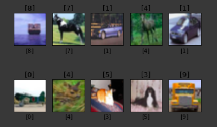
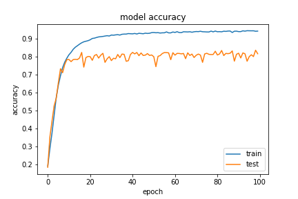
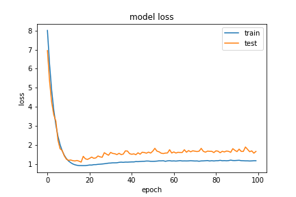

# Cifar10 with Convolutional Neural Network

<p align="center">
  
</p>

Objective of this project is to classify the datasets which include some images like(ship,dog,cat,airplane,deer... e.g.)into **10** labes. And our model predict accuracy is **0.7719** in ``VGG16``， most of the researcher also got **0.66 ~ 0.78** accuracy with these datasets, so our model make sounds good! We use the ``Cifar10`` datatsets for practice is because it only contain 10 different types of images in data,so you can go for ```Cifar100``` for larger datasets and details.

We will use two kinds of different neural network strcuture which are ``Alexnet`` and ``VGG16``.But we will focus on the research and discuss on ``VGG16`` at here.

## Labels

  - **0 : airplane**
  - **1 : automobile**
  - **2 : bird**
  - **3 : car**
  - **4 : deer**
  - **5 : dog**
  - **6 : frog**
  - **7 : horse**
  - **8 : ship**
  - **9 : truck**
  

## Structure 

1. **Neural Network Structure**
  - **Alexnet**
  <p align='center'>
    
  </p>
  
  - **VGG16**
  <p align='center'>
    
  </p>
  
  
  <p align='center'>
    
  </p>
  
  
  <p align='center'>
    
  </p>

2. **Model Structure and Layers(VGG16)**

<p align='center'>
    
</p>


## Requirement
  - **Python 3.8.2 or above**
  - **GPU (recommended)**
  - **Tensorflow**
  - **Keras**
  - **Matplotlib**
  - **Cifar10**
  
## Build
For .py file
```
python3 cifar10.py
```

```
python3 cifar10_VGG16.py
```
Or you can run the .ipynb file on notebook for tracking the output of each line.

## GPU Information


## Output
The following output image show the **Pediction of the Model** and the **Label** of each image.
The title of each image refer to it's **Model Prediction**,and the xlabel refer to it's **Label Answer**.
And it is briefly to observe that there only got almost **70% accuracy** of the prediction.



## Model Accuracy and Loss Variation
From the output we can observe that model **Loss** is getting decrease and **Accuracy** become greater and approach **0.7719**.





## Reference
* https://blog.csdn.net/JaysonRen/article/details/103273519
* https://www.itread01.com/content/1549021352.html
* https://github.com/BIGBALLON/cifar-10-cnn
* https://blog.csdn.net/bryant_meng/article/details/81626016
* https://blog.csdn.net/zhuzuwei/article/details/78652890
