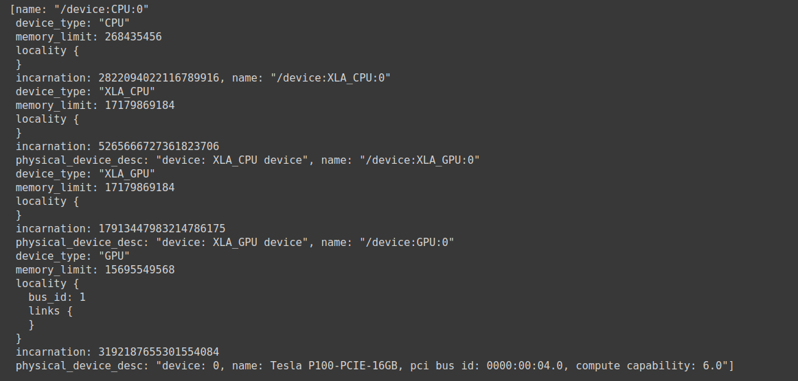

# Cifar10 with Convolutional Neural Network

<p align="center">
  
</p>

Objective of this project is to classify the datasets which include some images like(ship,dog,cat,airplane,deer... e.g.)into **10** labes. And our model predict accuracy is **0.8146** in ``VGG16``， most of the researcher also got **0.66 ~ 0.78** accuracy with these datasets, so our model make sounds good! We use the ``Cifar10`` datatsets for practice is because it only contain 10 different types of images in data,so you can go for ```Cifar100``` for larger datasets and details.

We will use two kinds of different neural network strcuture which are ``Alexnet`` and ``VGG16``.But we will focus on the research and discuss on ``VGG16`` at here.

## Labels

  - **0 : airplane**
  - **1 : automobile**
  - **2 : bird**
  - **3 : car**
  - **4 : deer**
  - **5 : dog**
  - **6 : frog**
  - **7 : horse**
  - **8 : ship**
  - **9 : truck**
  

## Structure 

1. **Neural Network Structure**
  - **Alexnet**
  <p align='center'>
    
  </p>
  
  - **VGG16**
  <p align='center'>
    
  </p>
  
  
  <p align='center'>
    
  </p>
  
  
  <p align='center'>
    
  </p>

2. **Model Structure and Layers(VGG16)**

<p align='center'>
    
</p>


## Requirement
  - **Python 3.8.2 or above**
  - **GPU (recommended)**
  - **Tensorflow**
  - **Keras**
  - **Matplotlib**
  - **Cifar10**
  
## Build
For .py file
```
python3 cifar10.py
```

```
python3 cifar10_VGG16.py
```
Or you can run the .ipynb file on notebook for tracking the output of each line.

## GPU Information



## Output
The following output image show the **Pediction of the Model** and the **Label** of each image.
The title of each image refer to it's **Model Prediction**,and the xlabel refer to it's **Label Answer**.
And it is briefly to observe that there only got almost **80% accuracy** of the prediction.


## Model Accuracy and Loss Variation
From the output we can observe that model **Loss** is getting decrease and **Accuracy** become greater and approach **0.8146**.

<p align='center'>
              
</p>


<p align='center'>
  
</p>  


<p align='center'>
  
</p>

## Note
I will take a note about what I had found about ***How the Parameters and Regularization affect your model accuracy and loss*** with this project as example. You also can check my commit history, I already mark down each change and how was the **Accuracy** affected.All the explanation will mentioned in a small word,I will make a clear **Technique Conclusion Note** later, and feel free to discuss with me!

  1. **Normalization with Mean and Standard Deviation**
     
     With the ``mean`` and ``std`` functions which are provided by the ``numpy`` library can help you to calculate the **mean** and **standard deviation** of your training and testing data, and make it become smooth and extreme value, data become closer to the medium and mean value.**In conclusion, it work! but just increase 0.4% accuracy**. In my opinion, this way is not helpful with these data, maybe it will work on the dataset that have too much extreme value or dirty, incomplete datasets.
     
  2. **Weight Decay**
     
     In a short word,``Weight Decay`` is one of the ``Regularization Techniques`` that used to avoid data become too specialized and cause overfitting.It will decrease the weight of each neuron and connection gradually and make our model not to become too complex.Once we get a greater value of ``Weight Decay``,that means the complex model will also have greater value of ``complex functions`` and ``complex problem``.**At all, Weight Decay=0.005 will have a better performance than 0.001**.
     
  3. **Batch Normalization**
  
     This is the most important part that cause the accuracy reach 0.7X , if you didn't take this step, you won't get a high accuracy like this.You can use ``BatchNormalization`` after each ``Conv2D`` or ``Dense``.The function of ``Batch Normalization`` is can help you to fasten conrvergence, avoid overfitting, no need to use ``dropout`` anymore(it will help you to select the best dropout parameter value), allow to use a higher ``Learning Rate`` at first.
     
     
     
* https://www.itread01.com/content/1549021352.html
* https://github.com/BIGBALLON/cifar-10-cnn
* https://blog.csdn.net/bryant_meng/article/details/81626016
* https://blog.csdn.net/zhuzuwei/article/details/78652890
